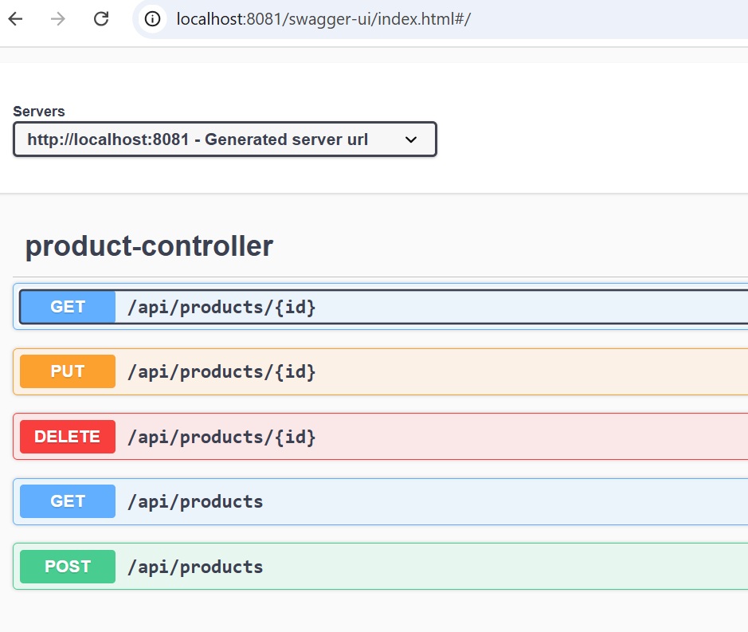
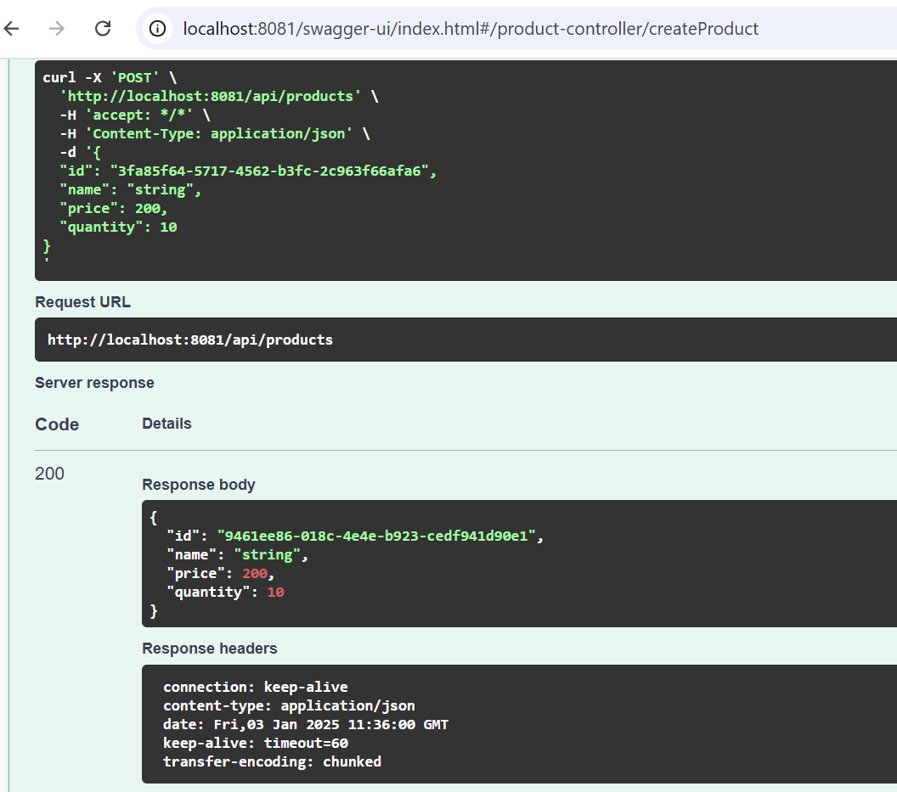
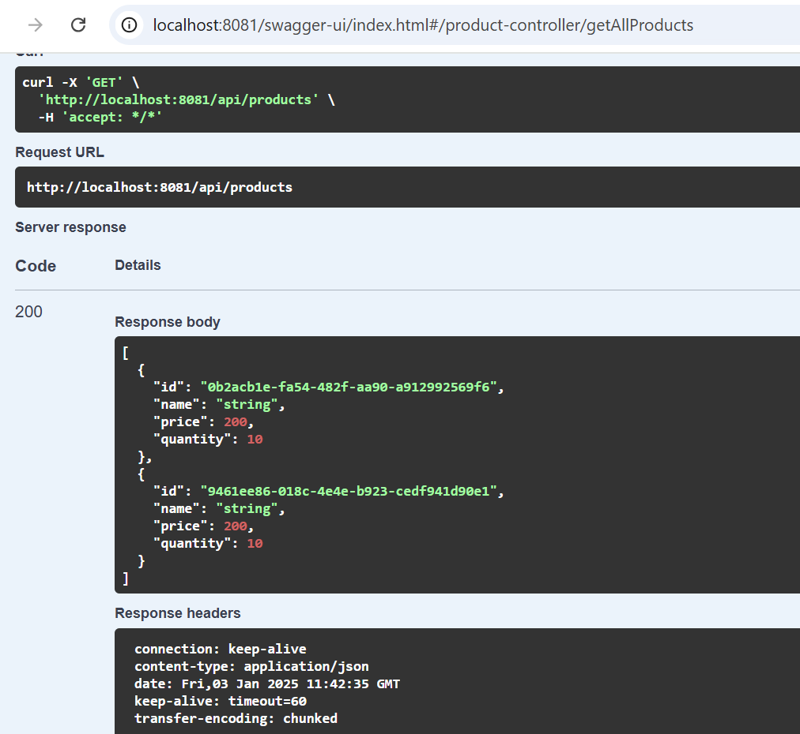
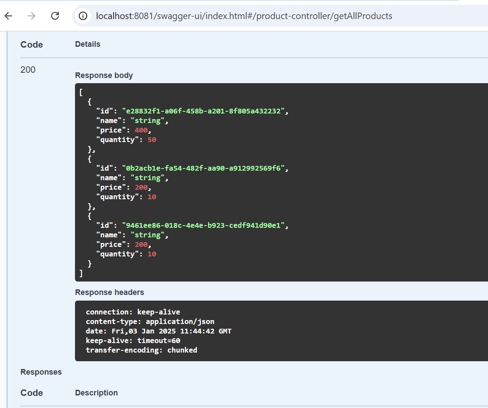

# gestion des produits avec Cassandra

Ce projet implémente la gestion des produits en utilisant Spring Boot et Cassandra comme base de données. L'API permet de réaliser les opérations CRUD (Create, Read, Update, Delete) sur les produits stockés dans la base de données Cassandra.

## Prérequis

- Docker (pour exécuter Cassandra en conteneur)
- Java 17 ou supérieur (pour l'application Spring Boot)
- Maven ou Gradle (pour la gestion des dépendances)
- Swagger pour la documentation de l'API

## Installation


1. Démarrez Cassandra avec Docker (si ce n'est pas déjà fait):

    ```bash
    docker-compose up -d
    ```

2. Exécutez l'application Spring Boot

  

3. Accédez à l'interface Swagger pour la documentation de l'API:

    ```
    [http://localhost:8081/swagger-ui.html](http://localhost:8081/swagger-ui/index.html#/)
    ```

## Structure du projet

- **`Product`**: Classe représentant les produits.
- **`ProductService`**: Service pour la logique métier.
- **`ProductRepository`**: Interface qui étend `CassandraRepository` pour les opérations CRUD avec Cassandra.
- **`ProductController`**: Contrôleur exposant les API REST pour les opérations CRUD.



## Endpoints API

Voici les principaux points de terminaison exposés par l'API :

### 1. **Créer un produit (POST)**

**Endpoint:** `product-controller/createProduct`

- Permet de créer un produit dans la base de données Cassandra.

#### Image Swagger : Create


### 2. **Obtenir tous les produits (GET)**

**Endpoint:** `/products`

- Permet de récupérer tous les produits de la base de données.


#### Image Swagger : Get All



### 3. **Obtenir un produit par ID (GET)**

**Endpoint:** `/products/{id}`


### 4. **Mettre à jour un produit (PUT)**

**Endpoint:** `/products/{id}`


#### Image Swagger : Update


### 5. **Supprimer un produit (DELETE)**

**Endpoint:** `/products/{id}`

- Permet de supprimer un produit spécifique en utilisant son `id`.


